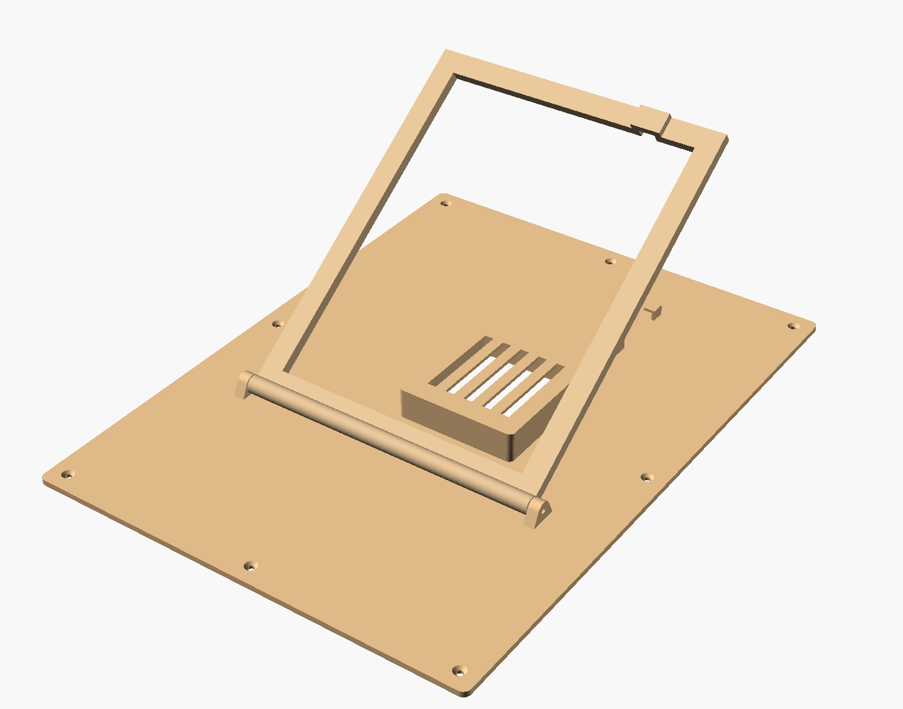

# GibBird: balcony bird camera + e-ink frame

A camera on the balcony spots birds, works out the species, and an A4 colour
e-ink frame in the bedroom shows who visited today. It's based on teddymakesstuff's
"Avian Visitors" frame, but that one listens for birds (BirdNET audio, hence
"Heard Today") and this one watches with a camera.

It's set up for **Gothenburg** first: a curated list of 58 local species with Swedish
names and a Swedish poster. Everything that depends on location sits in one region
file, so you can make a list for anywhere else (see [Other locations](#other-locations)).

```
 BALCONY                                         BEDROOM
 ┌──────────────────────────┐   Wi-Fi (HTTP)   ┌──────────────────────────┐
 │ Pi 5 + Camera Module 3   │ ───────────────▶ │ Pi Zero 2 W              │
 │ motion → crop → classify │  /api/summary    │ renders poster →         │
 │ SQLite log + bird photos │  /photos/…       │ Inky Impression 13.3"    │
 └──────────────────────────┘                  └──────────────────────────┘
```

## Step-by-step

1. **Buy the parts** (list below). Also get a feeder or perch about 0.5–1.5 m from
   where the camera will sit. The classifier needs the bird to fill a good part of
   the picture. A bird flying past at 5 m will not be identified.
2. **Pick and measure the frame.** Measure its outer size, the rabbet (the opening on
   the back where the display goes), and how deep the display sits below the back face.
3. **Print the back.** Enter your measurements in `hardware/frame_back.scad` and export
   `back_lower`, `back_upper` and `stand` (see [3D print](#3d-printed-back)).
4. **Flash two SD cards** with Raspberry Pi Imager → *Raspberry Pi OS Lite (64-bit)*.
   In the Imager settings, set Wi-Fi, enable SSH, and use the hostnames `birdcam`
   and `birdframe`.
5. **Build the frame.** Put the Pi Zero onto the display's 40-pin header. Put the display
   face-down in the frame with foam strips on top. Screw on the printed back,
   run the cable through the clips, and plug it into a USB charger.
6. **Build the camera.** Connect Camera Module 3 to the Pi 5 (with the Pi 5 camera
   cable) in a weatherproof box looking at the feeder. Power it from an outdoor socket
   or run a cable through the door/window seal.
7. **Install the software** on both Pis ([Software](#software)). Use
   `gibbird classify` on a few photos and check the web page at `http://birdcam.local:8080`.
8. **Tune** `min_score`, the camera angle and the feeder position in the first week.

## Shopping list

Prices are approximate (October 2026). Check Swedish shops first, e.g.
Electrokit, Kjell & Company or Webhallen. Pimoroni and The Pi Hut ship to Sweden.

**Bedroom frame**

| Part | Notes | ≈ Price |
|---|---|---|
| Pimoroni Inky Impression 13.3" (2025 ed., Spectra 6) | 1600×1200, 6 colours, PCB is exactly A4 (297×210 mm) | £230 / $275 |
| Raspberry Pi Zero 2 WH | "H" = header already soldered. The video uses a Pi 3 A+, which also works | 250 kr |
| microSD 32 GB (A1) | | 100 kr |
| 5 V 2.5 A micro-USB supply + 2–3 m **flat** micro-USB cable, right-angle plug | A flat cable lies neatly under the stand | 200 kr |
| A4 / 21×30 cm wooden frame | The back must be flat and about 20 mm wide so screws can go in. Check the rabbet depth | 150–300 kr |
| 6× wood screws 3×12 mm countersunk, 2× M3×16 screws | M3 screws are the stand's hinge pins | 30 kr |
| Self-adhesive foam/felt strips, 2–3 mm | Press the display against the glass | 50 kr |
| ~250 g PETG or PLA | | |

**Balcony camera**

| Part | Notes | ≈ Price |
|---|---|---|
| Raspberry Pi 5, 4 GB | Classifies a crop in roughly 30–60 ms | 750 kr |
| Raspberry Pi 5 Active Cooler | | 60 kr |
| Raspberry Pi Camera Module 3 (standard; NoIR not needed) | Autofocus helps at feeder distance | 300 kr |
| Pi 5 camera cable (22-pin → 15-pin, 200–500 mm) | The Pi 5 uses the small connector | 50 kr |
| Official 27 W USB-C power supply | Or the PoE+ HAT if you have PoE | 150 kr |
| microSD 32 GB **High Endurance** | It writes continuously | 150 kr |
| IP65 junction box with a clear lid, or a box with a window + cable gland + silica gel | Or put the camera indoors behind the balcony door glass. That avoids weather but you get reflections | 150–250 kr |
| Feeder / perch | This is what brings the birds to the camera | 100–300 kr |

**Total:** about 5,500–6,500 kr, mostly the display.

Single-Pi option: if the bedroom window looks onto the balcony, one Pi 5 with a long
camera cable can do both jobs. Run `gibbird cam` and `gibbird frame` on it with
`server = "http://localhost:8080"`.

## 3D-printed back

`hardware/frame_back.scad` is parametric. Install [OpenSCAD](https://openscad.org)
(the `openscad@snapshot` Homebrew cask works on macOS), open the file and use the
Customizer panel.



- **Back plate.** Covers the frame's back and screws into the wood with 6 screws.
  A vented hood covers the Pi, there's a slot for the power cable, and two snap-in
  clips guide the cable down to the bottom edge.
- **Flip-out stand.** A rectangular stand that folds flat around the hood. It pivots
  on two M3×16 screws that self-tap into the hinge blocks. A small stop tab behind the
  hinge sets the opening angle (`stand_open`, default 35°). The tab length is
  calculated from that angle. The cable passes under an arch in the foot.
- **Split.** The plate is 251×338 mm by default, so it is split into two pieces
  joined by a glued 16 mm lap joint (`split_y`). All parts fit a 256×256 bed.
  Glue with CA or epoxy.

Measure these before printing: `frame_w/h`, `rabbet_w/h`, `display_recess`, and the Pi
position `pi_cx/pi_cy`. The Pi position is measured from the bottom-left of the rabbet,
looking at the **back**, with the frame in portrait. Measure it with the Pi mounted on
the display. The file will refuse to render if the hood would collide with the stand
or the seam. The `stl/` folder has exports made with the default numbers, so treat
them as a test print only.

Print flat side down: 0.2 mm layers, 3 walls, 15 % infill. Only the hood roof
bridges, so no supports are needed. PETG handles a warm windowsill better than PLA.

## Software

```
gibbird/           Python package (both Pis)
  camera.py        Picamera2 / OpenCV frame sources
  motion.py        background-subtraction motion detector + crop
  classifier.py    TFLite / LiteRT classifier (Google iNat birds, 964 species)
  watcher.py       motion → classify → confirm over several frames → visits
  store.py         SQLite visit log
  server.py        HTTP API + a simple phone page
  render.py        e-ink poster (1200×1600) + language strings
  frame_app.py     polling, change detection, quiet hours
  data/regions/    species lists (gothenburg.csv)
hardware/          OpenSCAD model + STLs
scripts/           model download, region generator
systemd/           services for both Pis
```

How detection works. The 480×270 stream is checked for motion. Each moving region
is cut out of the full 2304×1296 frame as a square, padded, and classified. A
species only counts when it wins 2 of 4 checks in a row, and it must be on the region
list. This stops the model from reporting, say, an American goldfinch in Gothenburg.
Sightings less than 2 minutes apart count as one visit. The most confident photo of
each visit is kept.

The frame redraws only when the set of species or visit counts changes. It waits at
least 15 minutes between refreshes and stays dark 23:00–07:00. A full Spectra
refresh takes about 30 s and flashes. If nothing has been seen today, it shows the
last 7 days instead.

### Camera Pi (`birdcam`)

```bash
sudo apt update && sudo apt install -y git python3-picamera2 python3-opencv
git clone https://github.com/albinekstrom/gibbird.git ~/gibbird && cd ~/gibbird
python3 -m venv --system-site-packages .venv      # picamera2 comes from apt
.venv/bin/pip install -e '.[cam]'
scripts/download_model.sh
cp config.example.toml config.toml
rpicam-hello --list-cameras                        # camera detected?
.venv/bin/gibbird -c config.toml cam               # Ctrl-C when happy
sudo cp systemd/gibbird-cam.service /etc/systemd/system/
sudo systemctl enable --now gibbird-cam
```

### Frame Pi (`birdframe`)

```bash
sudo raspi-config nonint do_spi 0 && sudo raspi-config nonint do_i2c 0
# The 13.3" panel uses both SPI chip-selects itself (see Pimoroni's inky README):
echo "dtoverlay=spi0-0cs" | sudo tee -a /boot/firmware/config.txt && sudo reboot
sudo apt install -y git fonts-dejavu-core
git clone https://github.com/albinekstrom/gibbird.git ~/gibbird && cd ~/gibbird
python3 -m venv .venv && .venv/bin/pip install -e '.[frame]'
cp config.example.toml config.toml
.venv/bin/gibbird -c config.toml frame --once      # draws the panel once
sudo cp systemd/gibbird-frame.service /etc/systemd/system/
sudo systemctl enable --now gibbird-frame
```

If the poster comes out upside down, set `rotation = 270`.

### On your Mac (no hardware)

```bash
python3 -m venv .venv && .venv/bin/pip install -e '.[dev]' ai-edge-litert
scripts/download_model.sh
.venv/bin/pytest
.venv/bin/gibbird -c config.example.toml classify photo.jpg      # test the model
.venv/bin/gibbird -c config.example.toml demo --photos ~/birds   # poster.png, dithered like the panel
.venv/bin/gibbird -c config.example.toml frame --once --preview p.png  # against a running cam
```

Set `source = "opencv:0"` (webcam) or `source = "clip.mp4"` to run the full camera
pipeline on a laptop.

## Other locations

```bash
# Uses GBIF bird records within 15 km. Local names in any ISO 639-2 language (swe, deu, fra, …)
python3 scripts/make_region.py --lat 59.33 --lon 18.07 --radius 15 --lang swe \
    --min-records 200 --out gibbird/data/regions/stockholm.csv
```

Then set `region = "stockholm"` in `config.toml`. The generated list includes ducks,
waders and seabirds that won't land on a balcony. Delete those rows by hand, as was
done for `gothenburg.csv`. You can also add `aliases` for look-alikes the model knows
under another name (e.g. *Corvus corone* → Hooded Crow).
For poster text in another language, add an entry to `TEXT` in `gibbird/render.py`.

## Ideas for later

- Raspberry Pi AI Camera or AI HAT+ for a real bird detector instead of motion.
- Add BirdNET (audio) as well, like the original, so it covers "heard" and "seen".
- A weekly poster on Sundays, and a "first of the year" highlight.
