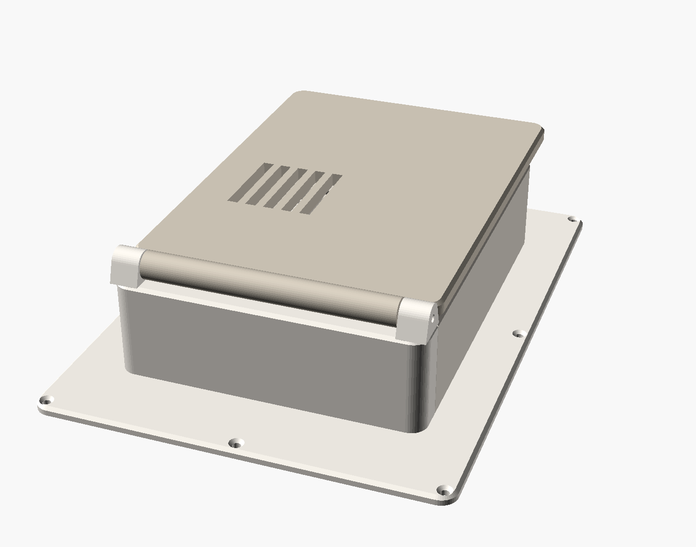

# GibBird: balcony bird camera + e-ink frame

A camera on the balcony spots birds, works out the species, and an A4 colour
e-ink frame in the bedroom shows who visited today. It's based on teddymakesstuff's
"Avian Visitors" frame, but that one listens for birds (BirdNET audio, hence
"Heard Today") and this one watches with a camera.

It's set up for **Gothenburg** first: a curated list of 58 local species with Swedish
names and a Swedish poster. Everything that depends on location sits in one region
file, so you can make a list for anywhere else (see [Other locations](#other-locations)).

```
 BALCONY (outside the office window)            OFFICE (hidden behind the frame)
 ┌────────────────────────┐  2–3 m USB cable   ┌──────────────────────────────────┐
 │ IMX678 USB camera, 123°│ ─────────────────▶ │ Raspberry Pi 4                   │
 │ in a printed housing,  │                    │  gibbird cam:   motion → crop    │
 │ strapped to a railing  │                    │                 → classify       │
 │ post                   │                    │  gibbird frame: poster → driver  │
 └────────────────────────┘                    │  HAT → Waveshare 7.3" e-ink panel│
                                               └──────────────────────────────────┘
```

## Step-by-step

**Placement:** [docs/INSTALLATION.md](docs/INSTALLATION.md) describes where the frame,
camera, feeder and cables go (office window + balcony), plus the weatherproof camera
housing (`hardware/camera_housing.scad`).

1. **Buy the parts** (list below). Also get a feeder for the railing and place it
   about 1.2–1.5 m from the camera. The classifier needs the bird to fill a good part
   of the picture.
2. **Frame:** BGA "Ram Galant Glas" 13×18 cm. The 3D model's defaults match it. If you
   use another frame, measure its outer size, the recess (`rabbet`) and its depth.
3. **Print** `back`, `panel_tray`, `pod_cover` and `stand` from `hardware/frame_back.scad`,
   and `body`, `lid` and `bracket` from `hardware/camera_housing.scad`
   (see [3D print](#3d-printed-back)).
4. **Flash the SD card** with Raspberry Pi Imager → *Raspberry Pi OS Lite (64-bit)*.
   In the Imager settings, set Wi-Fi, enable SSH, and use the hostname `birdframe`.
5. **Build the frame.** Glass → passepartout → display panel → printed panel tray, in
   that order, into the frame. Feed the panel's flat cable through the tray's slot.
   Take the Pi 4 out of its aluminium case (keep the stick-on heatsinks), screw it onto
   the four bosses in the printed back, and plug the driver HAT onto it. Then connect
   the flat cable to the HAT and screw the back onto the frame. Power and camera cables
   leave through the spine at the bottom edge.
6. **Mount the camera** on a railing post next to the office window, with two hose
   clamps (see [docs/INSTALLATION.md](docs/INSTALLATION.md)). Run the cable along the
   window frame, in through the window seal, and up the spine.
7. **Install the software** ([Software](#software)). Use `gibbird classify` on a few
   photos and check the web page at `http://birdframe.local:8080`.
8. **Calibrate** at `http://birdframe.local:8080/calibrate` ([below](#zones-and-calibration)).
9. **Tune** `min_score`, the camera angle and the feeder position in the first week.

## Shopping list

This is the current build: a Pi 4 behind a Waveshare 7.3" e-ink panel, and an IMX678
USB camera outside the office window. Prices are from amazon.se, October 2026.

**Already owned:** Raspberry Pi 4 Model B with its fan and heatsinks, the official Pi 4
USB-C power supply, a microSD 32 GB High Endurance card, and the BGA "Ram Galant Glas"
13×18 cm frame (walnut).

**Main parts**

| Part | Notes | ≈ Price |
|---|---|---|
| **Waveshare 7.3" 6‑Color e‑Paper HAT (E)** (E Ink Spectra 6, 800×480) | Comes with the driver board and a 40-pin extension header. The driver board plugs straight onto the Pi, so no ribbon cable is needed | 1 258 kr |
| **Iyalezirk IMX678 USB camera module, 8 MP, 123°** | USB, 4K MJPEG, 38×38 mm board. Sony Starvis 2 sensor, good in grey winter light. Sold by a third-party seller | 864 kr + 33 kr |

**For the frame and the Pi**

| Part | Notes | ≈ Price |
|---|---|---|
| 90° USB-C adapter (male → female) | So the power plug fits beside the Pi inside the pod | 50–100 kr |
| USB-A → 2-pin fan cable, 5 V | Powers the Pi-Fan from a USB port, since the display board takes the GPIO pins | 30–60 kr |
| Screw kit M2.5 + M3 (stainless) | Pi 4× M2.5×6, pod cover 4× M3×10 countersunk, stand 2× M3×16 | 100–200 kr |
| 6× wood screws 2.5×10 mm countersunk | Back plate to the frame (pre-drill 1.5 mm) | 30–50 kr |
| Self-adhesive foam/felt pads, 2–3 mm | Support the thin glass display panel evenly | 50–80 kr |
| PLA or PETG filament, ~300 g | For the indoor frame back and panel tray | – |
| Passepartout, white or black, 13×18 cm outer, window about **95×159 mm** | Hides the panel's border; window just inside the image area (160×96 mm). BGA's made-to-measure mat (179,90 kr), or cut black card yourself. Measure the panel first | 0–180 kr |

**For the camera outside**

| Part | Notes | ≈ Price |
|---|---|---|
| USB 2.0 extension, A‑male → A‑female, 2–3 m, **carries data** (flat if it crosses the window seal) | From the camera's cable to the Pi | 80–150 kr |
| 2× stainless hose clamps (band ≤ 12 mm) | Strap the camera bracket to a railing post without drilling. Choose a size that fits around the post plus the 8 mm base | 40–80 kr |
| EPDM/rubber tape | Between the bracket and the railing, to grip and protect the paint | 50 kr |
| PG9 cable gland, IP68 | Seals the cable into the housing | 50–80 kr |
| Round glass/acrylic disc, 32 mm × 2 mm | The housing's window (the size the housing model works out for this lens) | 30–80 kr |
| 2 mm silicone O-ring cord or EPDM foam gasket tape | Seals the housing lid | 50–100 kr |
| Clear outdoor silicone | Glues the window disc in | 60–100 kr |
| Silica gel sachets | Keep the housing dry; replace each autumn | 40–80 kr |
| ASA filament (PETG works; never PLA outdoors) | For the camera housing and bracket | 250–350 kr |
| Feeder for the railing + sunflower seeds | 1.2–1.5 m from the camera. Check your housing association's rules first | 150–350 kr |
| Optional: conformal coating spray | Extra moisture protection for the camera board | 100 kr |

**Total for what's left to buy:** about **3 000–3 500 kr** including the display and camera.

## 3D-printed back

`hardware/frame_back.scad` is parametric. Install [OpenSCAD](https://openscad.org)
(the `openscad@snapshot` Homebrew cask works on macOS), open the file and use the
Customizer panel.

| Stand open | Stand closed |
|---|---|
|  |  |

The back is one clean central column, and nothing else is visible:

- **Inside the frame:** glass → passepartout → **display panel** → **panel tray**. The
  tray is printed and holds the thin glass panel centred, supports its whole back
  (put a thin layer of foam in its pocket), and fills the rest of the 9 mm recess, so
  the back plate presses on it when screwed on.
- **Pod.** Hides the Pi (4 or 5) with the Waveshare driver HAT. The Pi screws onto four
  bosses on the plate. The pod **cover** is a separate part, printed roof-down for a
  smooth finish with no sagging spans. It comes off with 4 screws that are hidden
  under the stand, so you can reach the Pi without taking the back off the frame.
- **Fan.** A 30 mm fan mount and grille in the cover's roof, placed clear of the
  driver HAT. Air comes in through slots in the cover's bottom wall.
- **Spine.** A hollow channel from the pod down to the bottom edge, sloping down so the
  frame can lean back on its stand without the pod touching the table. The panel's
  flat cable comes up through a slot into the spine and runs inside it to the HAT. The
  power and camera cables leave through the spine at the bottom edge. Use a **90° USB‑C
  adapter**: there are 20 mm beside the Pi for the plug.
- **Stand.** A solid flap that closes over the pod and spine, so from behind the frame
  looks like a slab with one neat block on it. It has vent slots over the fan. It
  pivots on two M3×16 screws in towers at the top of the pod, and a stop tab sets the
  angle (`stand_open`, default 35°).
- **Plate.** 147×197 mm with rounded corners and softened edges, printed in one piece.
  It screws onto the frame with 6 small countersunk screws (2.5×10, pre-drill 1.5 mm).
  For a bigger frame, set `split_y` and print it in two glued halves.

**Assembly:** panel and tray into the frame (flat cable through the tray's slot) →
screw the Pi onto the bosses → plug the driver HAT onto the Pi (with its extension
header) → thread the power and camera cables up through the spine and plug them in
→ connect the panel's flat cable to the HAT → screw the back onto the frame → screw
the fan into the cover and plug its USB lead into the Pi → screw on the cover
(4× M3×10) → fit the stand (2× M3×16).

**Check when the display arrives:** the panel's outline (`panel`, default 111.2×170.2 mm),
its thickness, which edge the flat cable leaves from (`fpc_edge`, default bottom), and
the cable's width and length. If the cable is too short to reach the driver HAT, a
24-pin 0.5 mm FPC extension solves it. The file refuses to render if the cable slot
doesn't open into the spine or pod, if the slot is under the Pi, if the panel doesn't
fit the frame, or if the fan would sit over the HAT. The `stl/` folder has exports
made with the default numbers.

No part needs supports: plate and panel tray flat side down, cover roof down, stand
pod-side down. Use 0.2 mm layers, 3 walls and 15 % infill. PETG handles a warm windowsill
better than PLA. A matte or silk filament in one colour gives the cleanest look.

## Software

```
gibbird/           Python package
  camera.py        Picamera2 / OpenCV frame sources
  motion.py        background-subtraction motion detector + crop
  classifier.py    TFLite / LiteRT classifier (Google iNat birds, 964 species)
  watcher.py       motion → classify → confirm over several frames → visits
  store.py         SQLite visit log
  server.py        HTTP API + a simple phone page
  calibration.py   detection zones, image → real-world (cm) homography, size filter
  web/             calibration page
  render.py        e-ink poster (1200×1600) + language strings
  frame_app.py     polling, change detection, quiet hours
  data/regions/    species lists (gothenburg.csv)
hardware/          OpenSCAD model + STLs
scripts/           model download, region generator
systemd/           services (camera + frame, both on the same Pi)
```

How detection works. A low-resolution stream is checked for motion. Each moving region
is cut out of the full-resolution frame (12 MP on Camera Module 3) as a square, padded, and classified. A
species only counts when it wins 2 of 4 checks in a row, and it must be on the region
list. This stops the model from reporting, say, an American goldfinch in Gothenburg.
Sightings less than 2 minutes apart count as one visit. The most confident photo of
each visit is kept.

### Zones and calibration

Open `http://birdframe.local:8080/calibrate` while `gibbird cam` is running. It shows
a live snapshot.

- **Zones.** Outline where birds should be detected: railing, feeder, flower box.
  Motion outside the zones is ignored, so trees, the street and neighbours don't
  trigger anything.
- **Reference points.** Choose one flat surface where birds land, for example the
  face of the railing. Click 4 or more spots on it that you've measured with a tape,
  and type their positions in cm. From these the Pi works out how the picture maps to
  real centimetres. A white 50 cm grid is then drawn over the snapshot so you can
  check the fit. With 5 or more points it also shows a fit error.
- **What calibration gives you.** Zones are stored in centimetres. If the camera gets
  bumped, redo only the reference points and the zones stay where they were in the
  real world. Moving things outside the bird size range (default 6–80 cm) are ignored,
  such as a cat, a person or a flapping towel. Sizes are measured on the reference
  surface, so things far in front of or behind it are measured less accurately.

Everything is saved to `data/calibration.json` and applied immediately, without a
restart. The page has no login, so only use it on your home network.

The frame redraws only when the set of species or visit counts changes. It waits at
least 15 minutes between refreshes and stays dark 23:00–07:00. A full Spectra
refresh takes about 30 s and flashes. If nothing has been seen today, it shows the
last 7 days instead.

### Raspberry Pi (`birdframe`): deploy from your computer

You develop on your Mac and push to the Pi over SSH. The Pi doesn't need git or GitHub.

```bash
cp config.example.toml config.toml        # edit locally; it is copied on every deploy
scripts/deploy.sh --setup                  # first time: packages, SPI/I2C, venv, services
                                           # (reboots once; then run scripts/deploy.sh again)
scripts/deploy.sh                          # after every change: sync + restart
scripts/deploy.sh --logs                   # follow the logs
scripts/deploy.sh --status                 # services + CPU temperature
```

The target defaults to `albin@birdframe.local`; set `GIBBIRD_HOST=user@host` to change
it. The deploy uses rsync and leaves the Pi's `data/` folder (visits, photos,
calibration) and its Python environment alone. Python packages are only reinstalled
when `pyproject.toml` changes.

If the poster comes out upside down, set `rotation = 270`.

### On your Mac (no hardware)

```bash
python3 -m venv .venv && .venv/bin/pip install -e '.[dev]' ai-edge-litert
scripts/download_model.sh
.venv/bin/pytest
.venv/bin/gibbird -c config.example.toml classify photo.jpg      # test the model
.venv/bin/gibbird -c config.example.toml demo --photos ~/birds   # poster.png, dithered like the panel
.venv/bin/gibbird -c config.example.toml frame --once --preview p.png  # against a running cam
```

To run the full camera pipeline on a laptop, set `source = "opencv:0"` (webcam) or
`source = "clip.mp4"` (a video file).

## Other locations

```bash
# Uses GBIF bird records within 15 km. Local names in any ISO 639-2 language (swe, deu, fra, …)
python3 scripts/make_region.py --lat 59.33 --lon 18.07 --radius 15 --lang swe \
    --min-records 200 --out gibbird/data/regions/stockholm.csv
```

Then set `region = "stockholm"` in `config.toml`. The generated list includes ducks,
waders and seabirds that won't land on a balcony. Delete those rows by hand, as was
done for `gothenburg.csv`. You can also add `aliases` for look-alikes the model knows
under another name (e.g. *Corvus corone* → Hooded Crow).
For poster text in another language, add an entry to `TEXT` in `gibbird/render.py`.

## Ideas for later

- Raspberry Pi AI Camera or AI HAT+ for a real bird detector instead of motion.
- Add BirdNET (audio) as well, like the original, so it covers "heard" and "seen".
- A weekly poster on Sundays, and a "first of the year" highlight.
