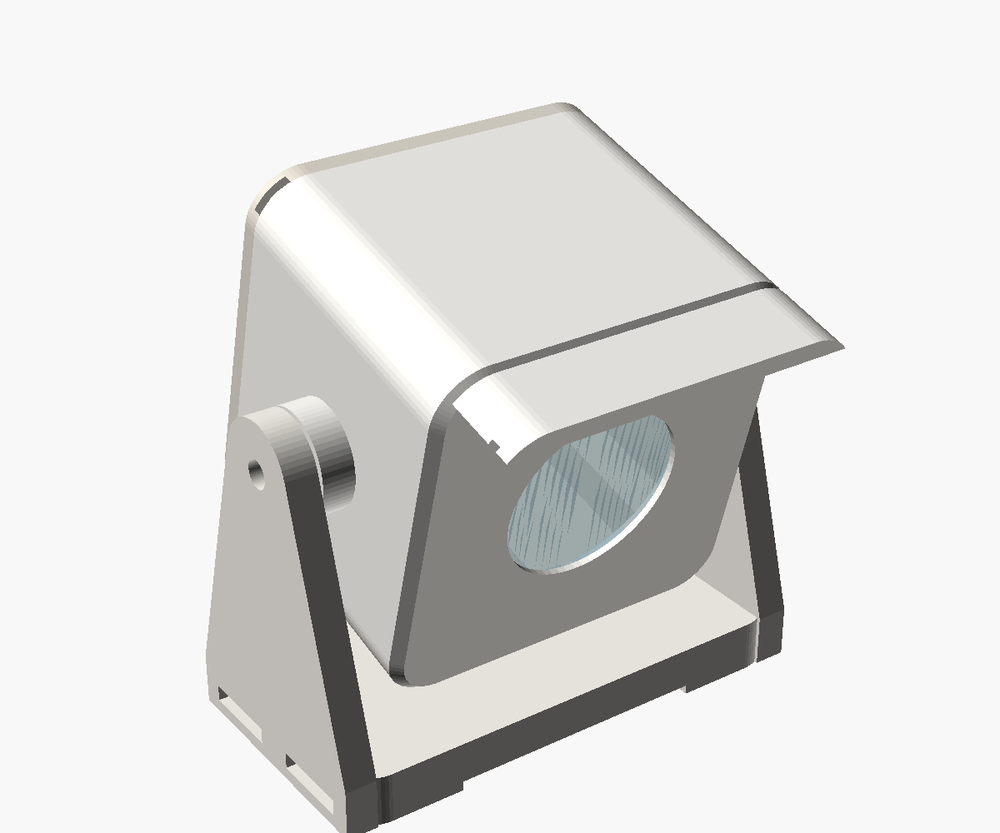
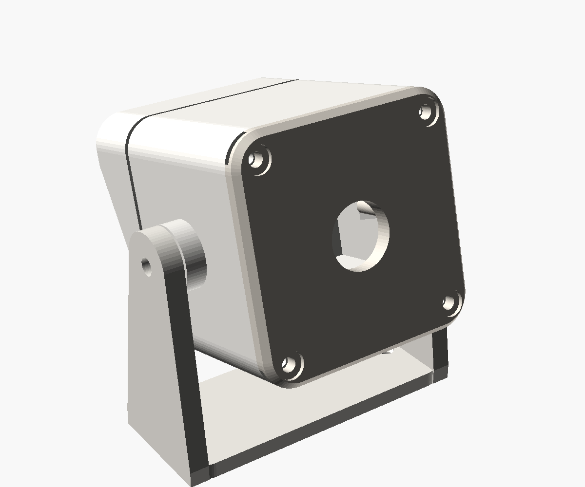

# Where everything goes

The frame stands in the office window, and the camera sits just outside that window,
looking at the balcony next to it. The camera cable comes in through the window
seal, so you don't drill anything and the cable run is short.

| Camera housing, front | Back (lid with gasket and cable gland) |
|---|---|
|  |  |

## Overview (seen from above)

```
                         ┌─────────────────────────── balcony railing ─────┐
                         │  ▲ flower boxes on the far railing              │
                         │                                                 │
                         │        BALCONY                                  │
                         │                                 ◆ FEEDER        │
                         │                                 (on the railing │
                         │                                  nearest the    │
                         │                                  window,        │
                         │                                  1–2 m from cam)│
   facade ───────────────┴──────────┐   ╲  view                           ─┘
                                     │    ╲
                           CAMERA ●──┘     (10–20° down, away from the sky)
       (outside, on the fixed window frame,
        upper left corner, under the slab above)
                                     ┊ cable: drip loop, then along the frame
   ══════════════ OFFICE WINDOW ═════╪══════════════════════════  (opens inwards)
                                     ┊ flat USB cable through the hinge-side seal
   ┌───────────── window seat / wooden shelf ─────────────────────┐
   │   [ FRAME ]  ← Pi 4 hidden in the back,      wall socket →  ◘ │
   │    stands on its flip-out stand                               │
   └───────────────────────────────────────────────────────────────┘
```

## 1. Camera: outside the window, upper left corner

**Where:** on the *fixed* outer window frame (the part that doesn't open), at the
upper left corner on the balcony side. Put it about 20–40 cm below the balcony slab
above, which keeps most of the rain off.

**Aim:** sideways along the facade, at the side of the balcony railing nearest the
window. Tilt it 10–20° down. That keeps the sky out of the picture (bright sky makes
the birds come out dark) and lets water run off the window disc. Your second photo is
roughly this view.

**Distance:** the feeder or perch should be **1–2 m** from the camera. With a wide 4K
camera, a 12 cm bird is about 190 px across at 1 m and 95 px at 2 m. The classifier
needs about 100 px to be reliable.

**Mounting** (the base of the tilt bracket):
- **Without drilling:** outdoor double-sided tape (3M VHB, outdoor grade). Clean and
  dry the paint first, and apply it above 10 °C so it bonds. Let it set for 24 hours
  before you hang the camera on it. This is reversible, which is good if the
  housing association or landlord has rules about the facade.
- **With screws:** 2 stainless screws, 4×25 mm, into the wooden window frame. Ask the
  housing association (BRF) or landlord first.
- **Never on the opening sash.** It moves, and the camera would lose its aim.

## 2. Feeder

- **Where:** on the balcony railing on the side nearest the window, 1–2 m from the
  camera. A railing feeder or a seed tray in a flower box both work.
- **Background:** if possible, have the lawn and trees behind it, not the sky. Calm
  backgrounds make motion detection more reliable.
- **Seed tray:** use a feeder with a tray underneath to catch spilled seed. Spilled
  seed attracts rats and pigeons.
- **House rules:** many housing associations in Gothenburg ban feeding birds on
  balconies, so check your association's rules (ordningsregler) first. If feeding
  isn't allowed, a perch or a bird bath also attracts birds.

## 3. Camera cable: from the camera to the frame (about 2.5–3 m)

1. Make a **drip loop** under the housing: let the cable hang a few cm lower than the
   gland before it goes up again. Water then drips off the bottom of the loop instead
   of running into the housing.
2. Run the cable along the outer frame to the **hinge side** of the window. Hold it
   with outdoor cable clips or small pieces of VHB tape.
3. Go **through the window seal on the hinge side**, where the seal is squeezed least.
   Use a **flat** USB 2.0 extension cable here (1–2 mm thick). Close the window
   and check that it still latches and doesn't let in a draught.
4. Inside, run the cable along the window frame and down to the window seat, then
   up into the spine at the bottom edge of the frame's printed back.

**Length:** about 0.5 m outside, 0.3 m through the window and 1–1.5 m inside, so a
**3 m flat USB 2.0 extension** is enough. Together with the camera's own cable,
it stays under the 5 m limit for USB 2.0 without an amplifier.

If you're allowed to drill, a 10 mm hole through the fixed frame is neater. Drill it
sloping slightly downwards towards the outside, and seal it with silicone.

## 4. Frame and Pi: on the window seat

- **Where:** on the wooden window seat, on the right side, near a wall socket. The Pi
  sits hidden in the printed back of the frame. Power it from the official Pi 4 power
  supply, and use a mains extension cord if the socket is far away. Don't use a long
  USB-C cable, because the Pi then gets too little voltage.
- **Heat:** don't put it directly above a radiator or in the afternoon sun. The fan
  helps, but a Pi behind a frame in the sun can get hot. You can check the
  temperature with `scripts/deploy.sh --status`.
- **Wi-Fi:** the Pi connects over Wi-Fi. If the poster stops updating, check the signal
  in the office first.
- **E-ink** doesn't glow and has no glare, so it looks like a print. It can stand
  facing the room in daylight.

## 5. Weatherproofing for a Swedish winter

The camera has to cope with rain most of the year, plus wet snow, frost (often around
0 °C, sometimes −10 °C), wind, and condensation every time the temperature drops.

- [ ] **Choose a camera rated to −20 °C** (e.g. Arducam IMX708 USB, −20 to +70 °C).
      Boards rated "0–50 °C" often still work, but they're outside their rating on the
      coldest days.
- [ ] Print the housing in **ASA**: it handles UV and frost best. PETG is OK. Never use
      PLA, which gets brittle in the cold and soft in the sun.
- [ ] Glue the window disc in from the inside with clear outdoor silicone, all the way
      round.
- [ ] Put 2 mm silicone O-ring cord (or foam gasket tape) in the lid groove. Screw the lid
      on evenly. **Close it on a dry day**, so you don't trap humid air inside.
- [ ] Put a **silica gel sachet** inside, and replace it each autumn. It stops the window
      from fogging up on cold mornings.
- [ ] Optional: brush the camera board with **conformal coating** (protective lacquer),
      keeping it off the lens and connectors.
- [ ] Tighten the cable gland around the cable, not around the plug.
- [ ] Make sure the rain hood is on top and the small weep hole points down. The long hood
      keeps driving rain and snow off the window.
- [ ] Make the drip loop under the housing.
- [ ] Leave the camera powered all the time. It gives off about 1 W of heat, which keeps
      the inside a few degrees above the outside temperature and the window free of frost.
- [ ] Check after the first heavy rain, and again after the first snow, that it's dry
      inside.
- [ ] Check now and then that snow hasn't built up in front of the hood.

## 6. After mounting

1. `scripts/deploy.sh --logs`: check that the camera starts ("USB camera running at
   3840x2160").
2. Open `http://birdframe.local:8080/calibrate`:
   - Draw a **zone** around the feeder and the railing, so passing people and the
     trees in the background are ignored.
   - Add **reference points:** measure the railing with a tape (for example its corners
     and the feeder) and click those spots. The 50 cm grid should then line up with
     the railing.
3. Watch `http://birdframe.local:8080` for a few days and tune `min_score` if needed.

## Parts for this step

| Part | ≈ Price |
|---|---|
| Wide-angle 4K USB board camera (38×38 mm board, M12 lens, UVC/MJPEG) | 500–900 kr |
| Flat USB 2.0 extension, 3 m | 100–150 kr |
| PG9 cable gland | 20 kr |
| Round glass/acrylic disc, 30 mm × 2 mm | 30 kr |
| 2 mm silicone O-ring cord or foam gasket tape | 50 kr |
| Clear outdoor silicone | 60 kr |
| 4× M3×12 and 2× M4×10 stainless screws + washers | 30 kr |
| Outdoor VHB tape (or 2× stainless 4×25 screws) | 80 kr |
| Outdoor cable clips | 40 kr |
| Silica gel sachets | 30 kr |
| Feeder for the railing | 150–300 kr |

The housing is `hardware/camera_housing.scad`. Measure your camera board (size, lens
length) when it arrives, then adjust the values at the top of the file and export
`body`, `lid` and `bracket`.
